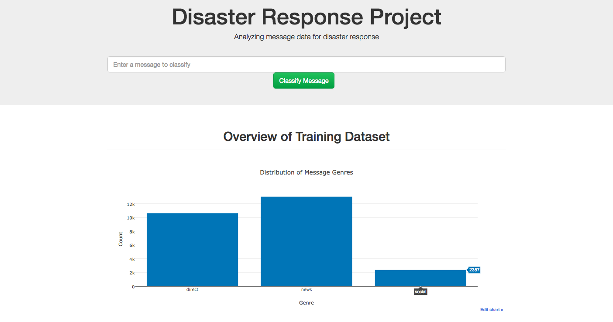

# Disaster Response Pipeline Project
Portfolio project to showcase Data Engineering skills from ETL & ML pipeline to simple web app

## Project Description
The project objective is to apply data engineering skills to analyze disaster messages data to build a model for an API that classifies disaster messages. The dataset is a real messages data from [Figure Eight](https://www.figure-eight.com) that were sent during disaster events. The maching learning pipeline is developed to categorize these events so that we can send the messages to an appropriate disaster relief agency. The project will include a web app where an emergency worker can input a new message and get classification results in several categories.

## Installation

1. Anaconda distribution of Python version 3.5 or later including NLTK, Scikit-Learn, Pandas, Numpy and Flask.

## Instructions:

1. Run the following commands in the project's root directory to set up your database and model.

    - To run ETL pipeline that cleans data and stores in database
        `python data/process_data.py data/disaster_messages.csv data/disaster_categories.csv data/DisasterResponse.db`
    - To run ML pipeline that trains classifier and saves
        `python models/train_classifier.py data/DisasterResponse.db models/classifier.pkl`

2. Run the following command in the app's directory to run your web app.
    `python run.py`

3. Go to http://0.0.0.0:3001/

## File Descriptions

1. `data/process_data.py`: The ETL pipeline used to process data prior machine learning model
2. `models/train_classifier.py`: The Machine Learning pipeline.
3. `app/templates/*.html`: HTML templates for the web app.
4. `run.py`: Start the Python server for the web app and prepare visualizations.

Note: Due to constraint size, the saved & tuned model is not uploaded.

## Licensing, Authors, Acknowledgements

Must give credit to Udacity and Figure Height for the data.  
